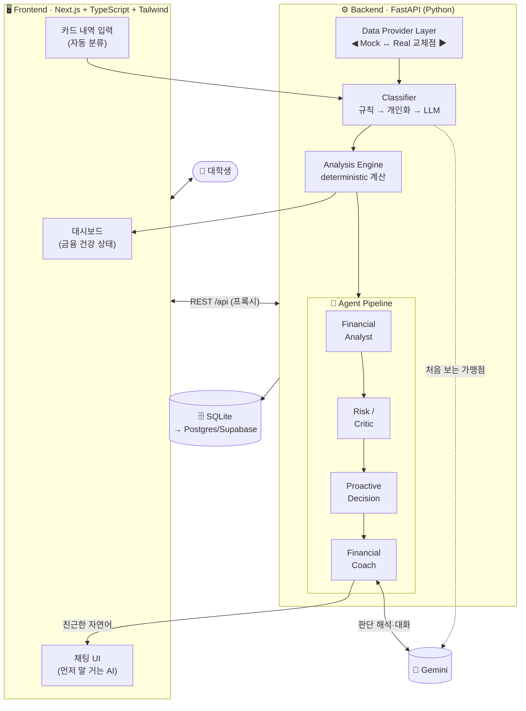

# MoneyMate 제안서 💸

> **가계부를 쓰게 만드는 서비스가 아니라, 가계부를 쓰지 않아도 나를 챙겨주는 금융 친구.**

대학생을 위한 **Proactive 금융 관리 AI**. 사용자가 직접 기록하지 않아도 소비 패턴을 관찰하고,
정말 필요한 순간 AI가 **먼저 말을 건다.**

---

## 1. 문제와 해결

| | 기존 가계부 | **MoneyMate** |
|---|---|---|
| 기록 | 사용자가 직접 입력·확인 | 카드 내역 넣으면 **자동 분류** |
| 상호작용 | 사용자가 열어봐야 함 | AI가 **먼저 말을 건다** |
| 조언 | "예산 초과", "쓰지 마라" | 상황 설명 + **선택지 제공** (심판 X) |
| 느낌 | 숙제 | *"얘가 나한테 뭐라고 할까?"* |

**타깃**: 소득이 불규칙(용돈·알바·장학금)하고 신용카드를 막 쓰기 시작한, 금융이 아직 어려운 대학생.

---

## 2. 핵심 철학

1. **계산은 코드가, 판단·대화는 LLM이.** 금융 숫자는 100% deterministic 코드로 계산하고, LLM은 그 결과를 해석·설명만 한다.
2. **통제하지 않고 설명한다.** 소비를 도덕적으로 평가하지 않고, 현재 상황과 선택지를 준다.
3. **아무 때나 말 걸지 않는다.** Risk/Critic이 "정말 개입이 필요한가"를 검증해 알림 피로를 막는다.
4. **교체 가능한 구조.** 실 금융 API 연동을 대비해 데이터 원천을 레이어로 분리(Mock ↔ Real).

---

## 3. 시스템 아키텍처



### 데이터 흐름 (핵심)
```
카드내역 입력 → 자동분류 → DB → deterministic 분석
   → Analyst(이상탐지) → Critic(개입검증) → Proactive(말걸지 판단) → Coach(LLM 자연어) → 사용자
```

---

## 4. Agent 파이프라인 상세

거래가 들어오면 4단계를 거쳐 "지금 먼저 말을 걸지"를 결정한다.

| 단계 | 역할 | 출력 |
|---|---|---|
| **Financial Analyst** | 분석 결과에서 이상/변화 신호 탐지 | `배달 급증`, `카드결제 과다`, `구독 증가` 등 (severity·confidence) |
| **Risk / Critic** | "정말 개입이 필요한가" 검증 (일회성? 이미 설명됨? 실제 위험?) | `NO_INTERVENTION` / `ASK_CONTEXT` / `WARN` / `COACH` |
| **Proactive Decision** | 알림 피로 방지 — 전역/주제별 쿨다운, "첫 접촉은 질문 하나" | 말 걸 핵심 1건 (또는 침묵) |
| **Financial Coach** | 검증된 판단 + **확정된 숫자**를 친근한 반말로 변환 | 사용자 메시지 (숫자는 코드값 그대로 잠금) |

### 실제 동작 예시 (구현됨)
```
①  AI:  "야 잠깐ㅋㅋ 이번 주 32만원 썼는데 평소보다 많아.
         특히 배달이 22만원으로 확 늘었던데, 무슨 일 있었어? 🍕"     ← ASK_CONTEXT

②  (2시간 뒤 자동 재판단 → 🔇 침묵, 알림 피로 방지)

③  사용자: "아 시험기간이라 배달 많이 시켰어ㅠㅠ"
    AI:  "아 그럼 이해했어. 대신 내일 카드값 68만원 빠지고 소득도 줄어서
         남은 기간만 살짝 신경 쓰면 좋을 것 같아."                  ← COACH
```

---

## 5. 구현 현황

| STEP | 기능 | 상태 |
|---|---|:---:|
| 1–4 | 기획 · 아키텍처 · MVP 범위 정의 | ✅ |
| 5 | DB 스키마 (6개 테이블, Postgres 호환) | ✅ |
| 6 | 현실적 대학생 Mock 데이터 (7개 소비 시나리오) | ✅ |
| 7 | 거래 자동 분류 (규칙→개인화→LLM) + **입력·학습 연결** | ✅ |
| 8 | 소비 분석 엔진 (deterministic 계산) | ✅ |
| 9 | Proactive Risk Agent (Analyst→Critic→Proactive) | ✅ |
| 10 | LLM Financial Coach (Gemini 연동) | ✅ |
| 11 | Chat UI (Next.js) | ✅ |
| 12 | "먼저 말을 거는" UX | ✅ |
| 13 | 가상 소비 시뮬레이션 ("20만원 써도 돼?") | ⬜ 예정 |

**부가 완료**: 친근한 금액 표기(`약 32만원`·`7만 6천원`), 폰 원격 개발 환경(Remote Control), GitHub 백업.

---

## 6. 주요 기능

- **거래 자동 분류** — 카드 내역 붙여넣기 → 규칙 매칭, 처음 보는 가맹점은 Gemini가 분류, 수정하면 개인화 학습.
- **소비 분석** — 주/월 지출, 지난달 대비 증감, 4주 평균, 카테고리 증가율, **다음 카드 결제 예정액**, 남은 예산, 예상 월지출. (전부 코드 계산)
- **Proactive Coaching** — 이상 패턴을 감지해 AI가 먼저, 하지만 꼭 필요할 때만 말을 건다.
- **금융 건강 대시보드** — 이번 달 지출·남은 예산·카드결제·카테고리 + AI 한 줄 요약.
- **챗봇** — "이번 달 왜 이렇게 썼어?" 등 질문에 실제 데이터 기반으로 답변.

---

## 7. 기술 스택

| 영역 | 기술 |
|---|---|
| Frontend | Next.js 14 · React · TypeScript · Tailwind CSS |
| Backend | Python · FastAPI · SQLAlchemy |
| DB | SQLite (MVP) → PostgreSQL / Supabase (호환 스키마) |
| AI | Gemini (`gemini-flash-lite-latest`, OpenAI 호환) · pluggable Provider · **키 없으면 규칙기반 fallback** |

---

## 8. 데이터 모델 (요약)

```
users            데모 사용자
user_profiles    월 예산 · 카드 결제일
transactions     거래 (소득/지출) — 원천 데이터
merchant_rules   가맹점→카테고리 (전역 규칙 + 개인화 override)
agent_events     AI가 먼저 말 건 기록 (알림 피로 방지 근거)
chat_messages    대화 히스토리
```

---

## 9. 설계 원칙 준수

- ✅ 실 금융 API 미연동 (Provider Layer로 교체점 분리)
- ✅ 금융 계산을 LLM에게 맡기지 않음 (숫자는 deterministic 코드)
- ✅ LLM은 판단·맥락·대화·개인화에만 사용
- ✅ 매 거래마다 알림 X (Critic + 쿨다운으로 알림 피로 방지)
- ✅ 소비를 도덕적으로 평가하지 않음
- ✅ 투자·대출·신용점수 확정 조언 금지
- ✅ 개인정보·실 금융정보 미사용 (Mock)

---

## 10. 향후 계획

- **STEP 13** — 가상 소비 시뮬레이션: 실제 결제 없이 "이거 사면 재무가 어떻게 되는지" 계산·설명.
- 새 거래 입력 시 Proactive Agent 자동 반영 (실시간 반응).
- 실 금융 API 연동 (`RealFinancialDataProvider`).
- 사용자 인증 · 다중 사용자 · Postgres 이전.

---

<sub>🤖 Generated with [Claude Code](https://claude.com/claude-code) · Repo: github.com/yunseul6028/MoneyMate</sub>
